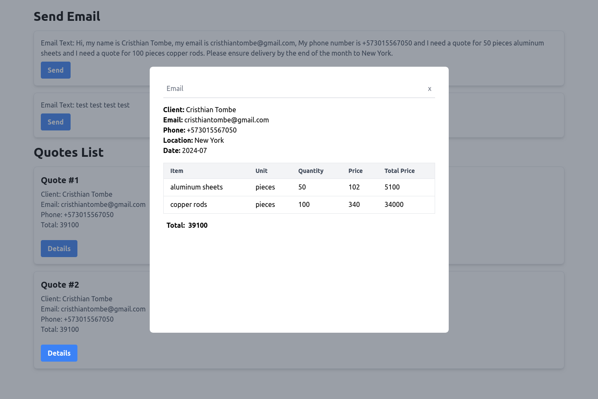

## Features

- **AI-Driven RFQ Processing:** Automatically process customer emailed requests for quotes (RFQs) using the latest AI tools.
- **Structured Quote Generation:** Convert RFQs into structured quotes that can be sent back to the customer.
- **One-Click Quote Sending:** Provide a feature for salespeople to respond to RFQs with a single click of a "Send Quote" button.


## Tech Stack

**Client:** 
- React (TypeScript), 
- Zustand (State management), 
- TailwindCSS (Style)
- Axios (Http requests)

**Server:** 
- Express (TypeScript), 
- node-nlp (Natural language utility for nodejs), 
- Sequelize (ORM for Sqlite)

## Requirements

List of tools required to run the project:

- [Docker](https://docs.docker.com/get-docker/)
- [Docker Compose](https://docs.docker.com/compose/install/)

## Installation

Steps to set up the development environment.

### 1. Clone the repository

```bash
git clone https://github.com/cristom-co/cotizacion-rfq.git
cd cotizacion-rfq
```

### 2. Build and run the containers
```bash
docker-compose up --build
```


## Screenshots



